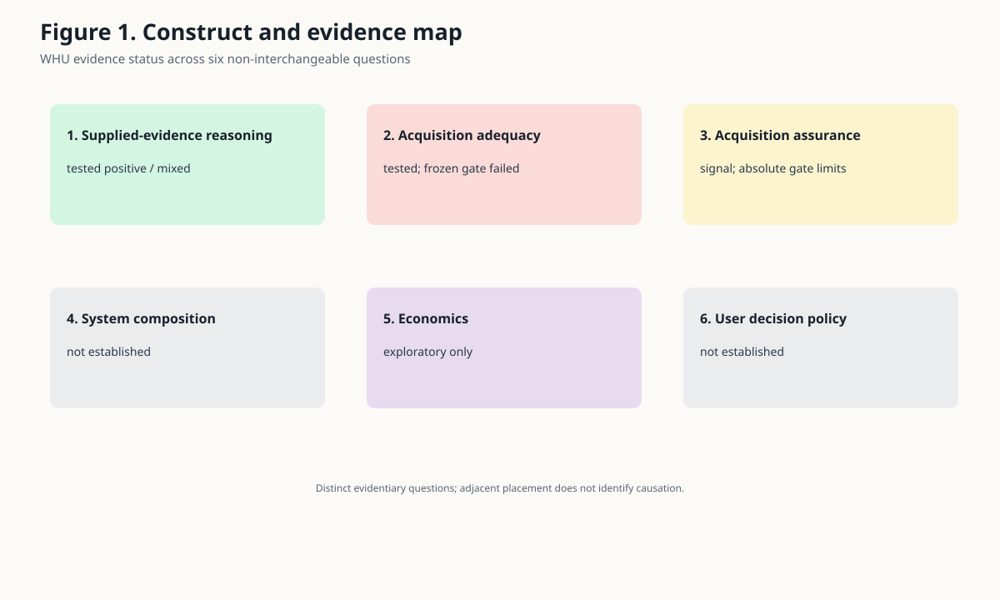
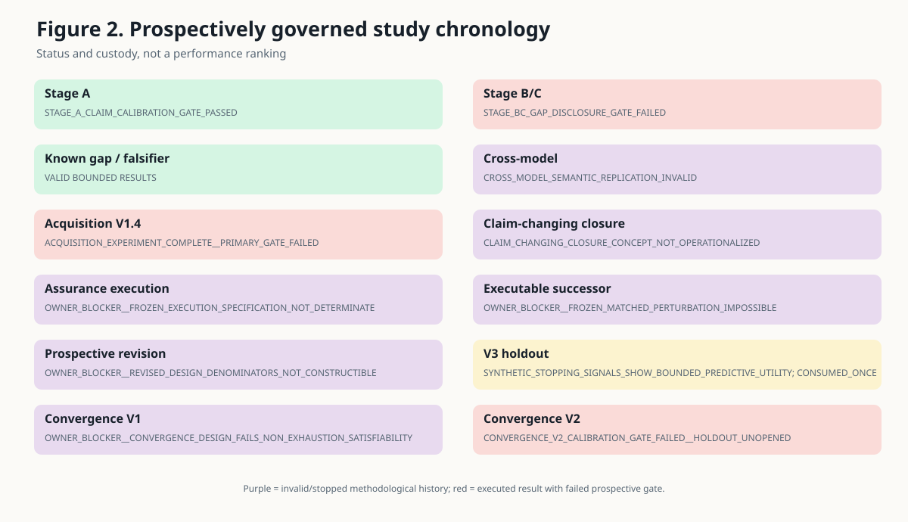
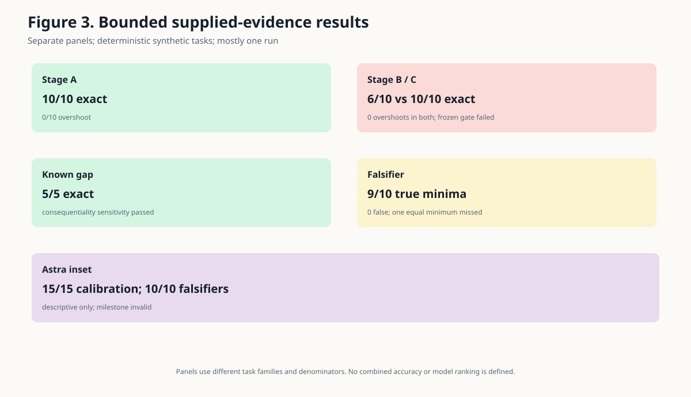
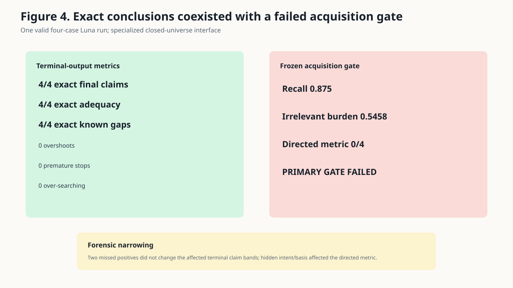
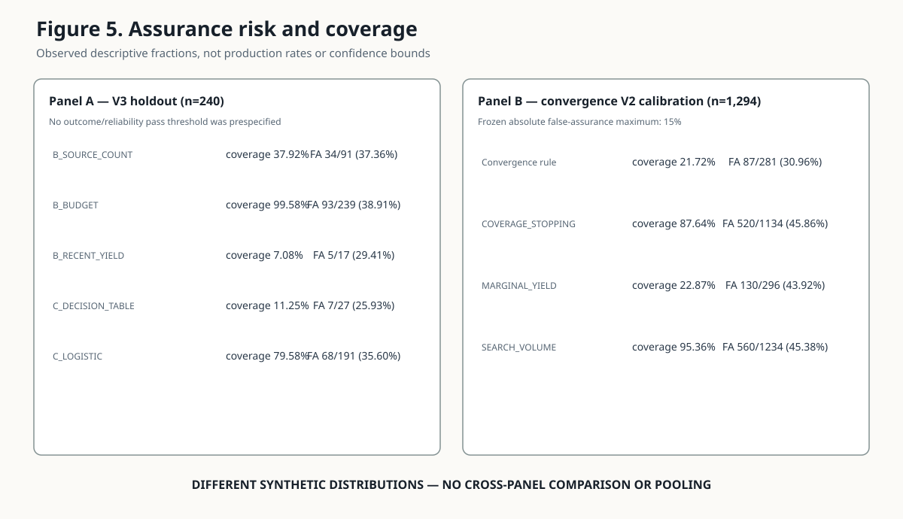
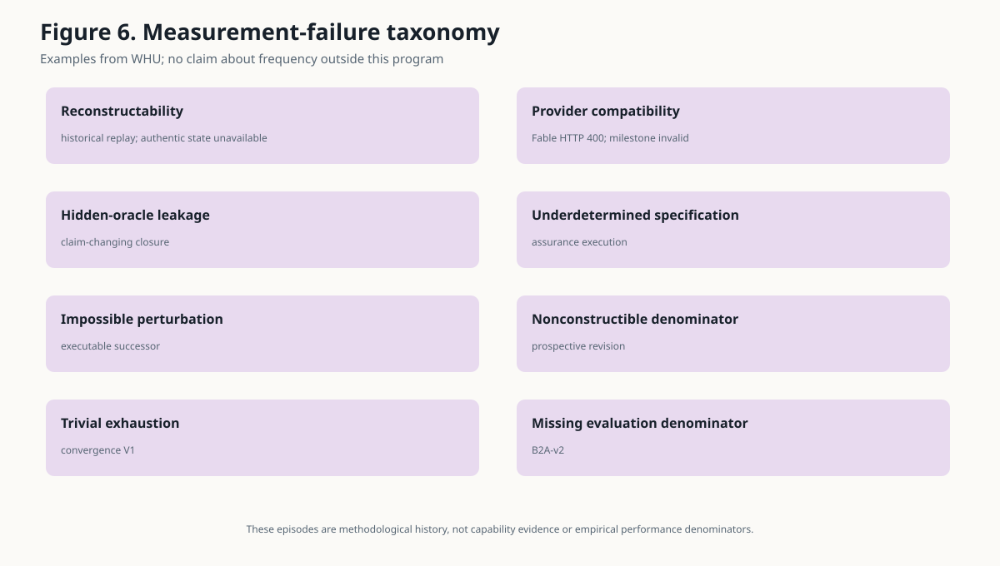

# Reasoning Over Evidence Is Not Assurance That the Evidence Was Acquired

## An exploratory empirical and methodological case study from WhatHoldsUp

**Working Paper v1.0.2 — September 2026**

**Author:** Frederick Ugast

**Affiliation:** Independent Researcher

**ORCID:** Not provided

## Abstract

Research systems can reason correctly over evidence they have been given while still lacking a reliable basis for saying that they acquired the evidence capable of changing their conclusion. This paper examines that distinction across a prospectively governed sequence of small WhatHoldsUp (WHU) studies. Evidence is stratified rather than pooled: `VALID_EMPIRICAL_EVIDENCE`, `DESCRIPTIVE_OBSERVATION`, `EXPLORATORY_POST_HOC_ANALYSIS`, `INVALID/INDETERMINATE_EXPERIMENT`, and `METHODOLOGICAL_HISTORY` have different inferential roles.

On deterministic supplied-evidence tasks, one Luna run was exact on 10/10 claim-strength cases, 5/5 known-gap cases, and 9/10 true minimum falsifiers with no false selections. Truthful gap disclosure changed exactness from 6/10 to 10/10 in a matched task, but the prospectively specified overshoot-reduction gate failed because neither condition overshot. Separately scoreable Astra observations were perfect on three frozen semantic families, but the overall cross-model milestone was invalid and supplied no Fable capability evidence. In a valid four-case controlled acquisition run, Luna produced 4/4 exact terminal claims, adequacy judgments, and known-gap reports while the conjunctive acquisition gate failed: consequential-evidence recall was 0.875, irrelevant-acquisition burden was 0.5458, and the directed-search metric was 0/4. A later bounded forensic analysis found that the two missed positive records could not change the affected terminal claim bands and that the directed metric depended on an exact hidden intent/basis predicate.

Two no-model synthetic assurance studies produced bounded but different results. On one exactly-once 240-row V3 holdout, whose omission prevalence was 93/240 (38.75%), frozen candidates occupied different observed risk–coverage points; a decision table recorded 7/27 false assurances at 27/240 coverage and a logistic candidate recorded 68/191 at 191/240 coverage. This is bounded descriptive predictive utility on one deterministic synthetic distribution, not an inferential or externally validated assurance result. A distinct convergence V2 rule was evaluated on a calibration distribution with omission prevalence 588/1,294 (45.44%) and recorded 87/281 false assurances at 281/1,294 coverage, failing its frozen 15% maximum despite outperforming eligible baselines on relative and chance-comparator components. Its 306-case holdout remained unopened. Together with the separate supplied-evidence and acquisition results, these are noncommensurate observations that motivate, but do not answer, a matched capability-versus-assurance question. They do not establish a capability–assurance asymmetry or scaling law, frontier-model incapability, a production error rate, a universal unsolved problem, or an acceptable deployment policy.

## 1. Introduction and research question

The motivating user is technically sophisticated but cannot independently audit every source, inference, and acquisition decision in a complex research report. For that user, a fluent answer with accurate citations may still leave an important question unanswered: could unseen evidence materially change the strongest defensible conclusion?

WHU separated that concern into six questions (Figure 1): reasoning conditional on supplied evidence; adequacy of acquired evidence; assurance about residual omissions; reliability of the composed system; economics of review and escalation; and the user's decision policy. A positive result on one layer does not settle the next. In particular, provenance can show where a claim came from without showing that the source set was adequate, and a correct final claim can coexist with an acquisition process that missed consequential records.

The primary research question is:

> Across the prospectively governed WHU studies, what evidence distinguishes a model's ability to reason over supplied evidence from a research process's ability to assure that it acquired the evidence capable of materially changing its conclusion?

The secondary methodological question is:

> What did the WHU sequence of frozen gates, invalid or stopped studies, exactly-once holdouts, and independent reviews reveal about the difficulty of measuring acquisition adequacy without turning hidden evaluator knowledge into a runtime oracle?

This is an exploratory empirical and methodological case study. It does not ask whether frontier AI is generally trustworthy, whether non-experts can never delegate research safely, or whether evidence completeness is impossible. Its candidate contribution is narrower: WHU found strong performance on small synthetic evidence-conditional reasoning tasks, while its prospective attempts to establish economical case-level assurance that claim-changing evidence had been acquired did not reach the reliability needed to justify general open-world reliance. This does not establish frontier-model incapability or universal unsolvedness.

## 2. Related work and context

WHU's concern is not a new field. The bounded state-of-field review found mature adjacent methods for most components, but no single reviewed public validation of the complete composition WHU sought.

Grounding and faithfulness evaluate whether output is supported by supplied context. FACTS Grounding explicitly evaluates responses against a provided document; RAG evaluation and research-agent benchmarks similarly separate retrieval and generation quality. These methods measure an important property, but supplied-context fidelity does not establish that the supplied context contains the evidence that matters.

High-recall and total-recall information retrieval, technology-assisted review, and systematic-review screening directly address unknown denominators, remaining relevant records, and stopping. Statistical stopping can support case-level statements in defined collections under assumptions [21], as can capture–recapture estimates of literature-search completeness [22]. Systematic-review practice also addresses upstream search construction through reproducible multi-source search and independent search-strategy review. These precedents defeat any novelty claim for retrieval completeness or convergence as such.

The missing-evidence literature is more decision-relative. ROB-ME and ROB-MEN assess whether missing studies or results could bias a specified synthesis, given assumptions about selection and missingness. Context-sufficiency work asks whether retrieved material is enough to answer a question, while selective prediction and abstention study risk–coverage trade-offs. Scalable oversight studies whether weaker supervisors can evaluate stronger systems, and assurance cases organize system claims, evidence, assumptions, and defeaters.

Deployed research systems add persistent and parallel search, authoritative corpora, citation agents, iterative retrieval, sufficiency checks, and professional review. Those are material counterexamples to any suggestion that the field ignores coverage. The bounded review nevertheless did not identify public, independently validated evidence of an economical, calibrated, case-level guarantee that no unseen evidence would materially change an open-ended conclusion for a user unable to audit it. That is a bounded validation/composition finding, not proof of absence, novelty, or general incapability. Table 6 maps these adjacent literatures to WHU's narrower boundary.

## 3. Methods

### 3.1 Program governance

The studies were governed by explicit directives, frozen protocols or packages, prospective gates where applicable, durable result artifacts, and terminal closeouts. Negative, invalid, indeterminate, and stopped results were preserved rather than overwritten by successor designs. Holdouts could be consumed only under hash-bound authority; the V3 holdout was evaluated once, while convergence V2 stopped after calibration and left its holdout unopened.

Fresh independent review was used as defect detection, not as proof that a surviving design was true. Several reviews caused prospective corrections before execution. When a defect required scientific redesign outside the authorized milestone, the program stopped rather than silently repairing the study.

Figure 2 records the chronology by exact terminal disposition. Red boxes are executed studies with failed prospective gates; purple boxes are invalid or stopped methodological history. They are not the same evidentiary outcome.

### 3.2 Evidence-status framework

The manuscript uses five reader-facing evidence classes:

1. **`VALID_EMPIRICAL_EVIDENCE`**: an executed, prospectively frozen, reconstructable study, interpreted only within its exact task, model, run, and partition.
2. **`DESCRIPTIVE_OBSERVATION`**: a separately scoreable observation inside a milestone that was invalid overall; it cannot validate the intended comparison.
3. **`EXPLORATORY_POST_HOC_ANALYSIS`**: a post-hoc routing, forensic, or assumed-detection analysis; it may generate or narrow hypotheses but cannot become confirmatory evidence.
4. **`INVALID/INDETERMINATE_EXPERIMENT`**: a study whose design, execution, custody, provider compatibility, or evaluator did not support its intended inference.
5. **`METHODOLOGICAL_HISTORY`**: a stopped design or review episode used only to analyze measurement and governance.

The internal inventory also distinguishes valid bounded analysis, external literature, and narrative context. These map into the five reader-facing classes without changing their inference limits. Unlike task families are never pooled, and an unopened holdout contributes no performance result.

### 3.3 Semantic tasks

The semantic tasks used deterministic closed universes with integer-valued records and prospectively defined strongest-supportable claim categories. Stage A supplied complete or explicitly bounded evidence states. The matched Stage B/C task varied truthful disclosure of a finite acquisition gap. The known-gap task supplied bounds on unresolved records and tested whether the output responded to their consequentiality. The falsifier task offered candidate evidence packages and asked for minimum packages that weakened the current claim.

Most valid semantic observations came from one `gpt-5.6-luna` run per task family. A later cross-model milestone attempted the same frozen families with Astra and Fable. Astra completed all three families; Fable's first request returned HTTP 400 and the no-retry rule ended the milestone. The intended cross-model replication was therefore invalid.

### 3.4 Controlled acquisition task

The acquisition study placed one Luna run behind a specialized search/acquisition interface over four prospectively known closed evidence universes hidden from the model. The scorer separately evaluated terminal claims, adequacy and known-gap reporting, consequential-evidence recall, irrelevant-acquisition burden, directed search, premature stopping, over-searching, and budget compliance. The primary gate was conjunctive.

### 3.5 Synthetic acquisition-assurance tasks

V3 generated 1,200 deterministic observations with eight runtime-visible stopping-state features `X` and hidden residual-omission labels `Y`. Candidate selection occurred on 960 calibration observations; the frozen candidates were evaluated once on a 240-row holdout. The V3 design froze candidate-selection procedures but did not specify an outcome/reliability pass threshold. Its holdout fractions are descriptive, not pass/fail reliability estimates.

Convergence V2 used a distinct 1,600-universe package with structurally non-exhaustive, isolated acquisition processes. A sole rule, baselines, a fixed permutation comparator, and a conjunctive calibration gate were frozen. The rule had to keep false assurance at or below 15%, improve on the best eligible baseline by the specified relative amount, and exceed its chance comparator. Only a passing calibration could authorize access to the 306-case holdout.

### 3.6 Quantitative fidelity

All reported WHU result quantities in the figures, result narrative, and quantitative tables resolve to frozen JSON paths or exact Markdown source locators and SHA-256 hashes in `WHU_WORKING_PAPER_EXACT_NUMBER_MANIFEST.json`. The six figures are deterministic SVGs built locally from those artifacts. Tables 1–6 are in `WHU_WORKING_PAPER_SUPPLEMENTARY_TABLES.md`. No model, provider, search, or web call was used to reconstruct the results.

## 4. Results

### 4.1 Supplied-evidence reasoning

Figure 3 and Table 2 present separate panels rather than a pooled score.

In Stage A, Luna produced 10/10 exact claims with zero overshoots and zero unnecessary weakenings. In the matched Stage B/C task, condition B without truthful finite-gap disclosure produced 6/10 exact claims and four unnecessary weakenings; condition C with the disclosure produced 10/10 exact claims and no unnecessary weakenings. Both conditions produced zero overshoots. The prospectively specified gate required overshoot reduction, so the exact disposition remains `STAGE_BC_GAP_DISCLOSURE_GATE_FAILED`. A later bounded forensic analysis linked the four corrected cases to newly finite completion bounds, but could not identify cueing or run noise and did not rescore the failed gate.

The known-gap task produced 5/5 exact claims, no overshoots or unnecessary weakenings, and passed its consequentiality-sensitivity check. The falsifier task recovered 9 of 10 true minimum falsifiers with zero false selections and the correct weakening level for all nine identified items. The miss occurred where two equal minima existed and only one was returned. These tasks supplied bounds or candidate packages; they did not test open-world discovery.

The cross-model milestone has the exact disposition `CROSS_MODEL_SEMANTIC_REPLICATION_INVALID`. Astra's separately scoreable observations were perfect on the frozen metrics: 15/15 calibration decisions across the three completed semantic families and 10/10 genuine falsifiers, with no overshoots, unnecessary weakenings, or false falsifiers. These are `DESCRIPTIVE_OBSERVATION`, not a valid replication result. Fable produced no semantic capability evidence.

### 4.2 Controlled acquisition

The acquisition run demonstrates why terminal correctness and acquisition adequacy must be reported separately (Figure 4). It produced 4/4 exact terminal claims, 4/4 exact adequacy judgments, 4/4 exact known-gap reports, no overshoots, no premature stops, and no over-searching. It nevertheless failed the frozen conjunctive acquisition gate: consequential-evidence recall was 0.875, irrelevant-acquisition burden was 0.5458333333333333 (displayed as 0.5458), and falsifier-directed search was 0/4. The exact terminal disposition is `ACQUISITION_EXPERIMENT_COMPLETE__PRIMARY_GATE_FAILED`.

A later `VALID_BOUNDED_ANALYSIS` found that cases EA02 and EA04 each missed one consequential positive record, but neither miss could change its terminal claim band. Every trajectory used the designated weakening route and resolved its frozen falsifier. The 0/4 directed score depended on an exact hidden intent/basis predicate: two cases used different intent labels and two used the required label from a basis other than the scorer's hidden eligible set. This narrows the interpretation but does not reverse the failed gate. The run shows that a correct conclusion can coexist with incomplete acquisition; it does not establish a broad compositional-capability failure.

### 4.3 Acquisition assurance

Figure 5 separates V3 holdout observations from convergence V2 calibration. Their distributions, rules, denominators, and inferential frameworks differ.

On the 240-row V3 holdout, 93 cases had a hidden claim-changing omission, an omission prevalence of 93/240 (38.75%). The decision-table candidate assured 27 cases and recorded 7 false assurances (25.93%) at 11.25% coverage. The logistic candidate assured 191 cases and recorded 68 false assurances (35.60%) at 79.58% coverage. Three simple baselines occupied other risk–coverage positions: recent yield had the lowest observed false-assurance fraction among the trivial baselines, 5/17 (29.41%), at 7.08% coverage; source count recorded 34/91 (37.36%) at 37.92% coverage; and the budget baseline recorded 93/239 (38.91%) at 99.58% coverage. The frozen candidates and proxies thus occupied different observed risk–coverage points on this one deterministic synthetic distribution. This is bounded descriptive predictive utility, not established population discrimination, a general assurance signal, or low-risk reliance. V3 had no prespecified inferential comparison, uncertainty interval, reliability threshold, or external validation and is not a production or open-world error-rate study.

The post-hoc selective-escalation analysis reused the consumed V3 holdout and is `EXPLORATORY_POST_HOC_ANALYSIS`. It found no complete-tie threshold below 10% observed false assurance. The best observed complete-tie point recorded 23/78 false assurances while escalating 162/240 cases (67.50%). Favorable second-review scenarios were assumptions, not measured reviewer performance. No routing policy or economic threshold was validated.

On all 1,294 convergence V2 calibration cases, 588 had a hidden claim-changing omission, an omission prevalence of 588/1,294 (45.44%). The sole frozen rule assured 281 cases and recorded 87 false assurances (30.96%). Among the 1,013 cases classified `NOT_ASSURED`, 512 were adequate (50.54%); under V3's false-withholding denominator, 512 of 706 adequate cases were withheld (72.52%). The latter is a cross-definition sensitivity derived from frozen counts, not a replacement or rescore of the frozen V2 metric. The rule reduced false assurance 29.50% relative to the best eligible baseline and observed convergence was 2.702 times the fixed permutation comparator. Those components passed, but the absolute false-assurance fraction exceeded the frozen 15% maximum. The conjunctive gate therefore failed, no selectable rule remained, and the exact disposition is `CONVERGENCE_V2_CALIBRATION_GATE_FAILED__HOLDOUT_UNOPENED`. The 306-case holdout was not accessed and supplies no result.

### 4.4 Integrated result

The valid record supports three separate observations. Small supplied-evidence tasks showed strong performance. The acquisition run produced correct outputs while failing its acquisition gate. On one deterministic synthetic distribution, V3 candidates occupied different observed risk–coverage points from frozen proxies; on a distinct synthetic calibration distribution, convergence V2 improved on eligible baselines and its chance comparator but failed its prospective absolute calibration criterion. These observations involve different tasks, systems, distributions, denominators, and measurement objects. They motivate a matched capability-versus-assurance question but do not estimate an effect size or slope, establish a causal comparison or model ranking, or demonstrate low-risk open-world reliance.

## 5. Methodological failures and what they establish

Invalid and stopped studies are not negative model results. They do, however, document the practical difficulty of constructing a measurement in which hidden completeness is knowable to the evaluator but unavailable to the acquisition process.

Historical replay attempts could not isolate a stronger-model counterfactual because authentic state, provider equivalence, leakage controls, and evaluators could not be reconstructed. Historical task re-execution stopped as `HISTORICAL_COUNTERFACTUAL_PROGRAM_NOT_RECONSTRUCTABLE`; the prospective boundary benchmark stopped before model execution because specifications conflicted and the evaluator was absent.

The claim-changing closure experiment first stopped at `OWNER_BLOCKER__PREEXECUTION_REVIEW_NOT_PASSED`. Its adjudication ended at `CLAIM_CHANGING_CLOSURE_CONCEPT_NOT_OPERATIONALIZED`: a decision-critical case required a runtime closure answer that depended on hidden evaluator knowledge and conflicted with a required later budget-exhaustion path. Capability remained `NOT_MEASURED`.

Three assurance-design episodes then exposed different construction failures. Exact execution stopped at `OWNER_BLOCKER__FROZEN_EXECUTION_SPECIFICATION_NOT_DETERMINATE` because the generator and required analyses were not uniquely specified and no reviewed runner existed. An executable successor stopped at `OWNER_BLOCKER__FROZEN_MATCHED_PERTURBATION_IMPOSSIBLE` because the allowed perturbations could not change the claim band. A prospective revision stopped at `OWNER_BLOCKER__REVISED_DESIGN_DENOMINATORS_NOT_CONSTRUCTIBLE` when corrected satisfiability checks found no strict eligible states and only one paired primary block.

Convergence V1 stopped at `OWNER_BLOCKER__CONVERGENCE_DESIGN_FAILS_NON_EXHAUSTION_SATISFIABILITY` because the union of two processes could exhaust too many universes, allowing trivial agreement. B2A-v2 remained `NOT_INTERPRETABLE` because it lacked a valid evaluation denominator and durable state. The cross-model milestone was invalidated by provider incompatibility under a no-retry rule. Table 4 preserves the exact dispositions, whether a model was called, the valid remainder, and the prohibited inference for each episode.

These episodes establish that reconstructability, denominator construction, hidden-oracle separation, execution determinacy, custody, and evaluator design were substantive problems in WHU. They do not establish that these problems are universal, that frontier models caused them, or that adequate measurements cannot be built.

## 6. Discussion

### 6.1 What the evidence supports

The strongest supported interpretation is a bounded, stratified record: evidence-visible semantic reasoning was strong on the supplied synthetic tasks; one controlled acquisition run reached correct terminal conclusions while failing its frozen acquisition gate; and two no-model synthetic assurance studies produced the distinct results described above. Because these studies differ in tasks, systems, distributions, denominators, and measurement objects, WHU has not demonstrated a capability–assurance asymmetry, gap, horizon ordering, effect size, slope, or scaling law. The observations instead motivate a matched research question about how task capability and independently grounded assurance reliability, coverage, and full cost scale under common measurement.

The result is not that runtime features or convergence are useless. V3 candidates occupied different observed risk–coverage points from frozen proxies, and convergence V2 improved on eligible baselines and its chance comparator. Observed false assurance remained substantial in V3's descriptive holdout results and exceeded the frozen 15% maximum in convergence V2 calibration. A failed prospective gate must remain failed even when secondary components pass.

### 6.2 Competing explanations

Several alternatives constrain the interpretation.

First, the semantic tasks were small, deterministic, and unusually explicit. Their strong results may reflect task simplicity, designer regularities, or complete supplied structure rather than performance on natural research.

Second, the apparent semantic/acquisition contrast compares different task difficulties and sample sizes. It is qualitative, not causal. The acquisition failures may reflect interface design, instruction wording, metric construction, or evaluator entanglement rather than a model's underlying ability to search.

Third, stronger models or better tools could improve acquisition. WHU did not validly test that proposition: the cross-model milestone was invalid, Fable produced no capability evidence, and Astra's results covered only the supplied-evidence tasks.

Fourth, synthetic assurance distributions may encode unrealistic base rates, route structure, or missingness. Exact hidden labels were possible only because the worlds were constructed. V3 holdout omission prevalence was 93/240 (38.75%); convergence V2 calibration omission prevalence was 588/1,294 (45.44%). Absolute false-assurance results and the feasibility of a fixed threshold depend on these constructed joint distributions of labels and visible features. No Bayes-optimal or oracle risk–coverage frontier was prespecified or computed. Whether an observed risk–coverage point is useful for a decision also depends on the applicable loss and cost function.

Fifth, two nominally isolated processes can share routes, priors, or blind spots. Agreement is therefore not statistical independence, and convergence need not imply completeness. Capture–recapture and high-recall IR already make the required assumptions explicit in bounded settings.

Sixth, professional and domain-bounded systems may be much more tractable. Curated corpora, authoritative databases, reproducible searches, expert search review, source-linked outputs, and accountable practitioners can relocate or reduce the problem. Conventional engineering and expert review may solve important practical cases without a general open-world certificate.

Finally, failed gates and an unopened holdout demonstrate governance adherence, not mechanism impossibility. Convergence V2 could perform differently on its unseen holdout or in another study; WHU has no result either way because the frozen rule did not earn access.

### 6.3 Implications

Evaluations of research agents should report the evidence object being assured. Answer correctness, citation support, source authority, topical recall, and residual claim-changing omission are not interchangeable. When a study uses hidden completeness labels, the runtime process must not receive them directly or indirectly. When it uses risk–coverage language, the risk definition, partition, selection rule, and absolute gate should be frozen before holdout access.

For deployment, citations and provenance remain valuable because they improve traceability and enable professional checking. They should not be advertised as proof that the source set was adequate. Likewise, abstention and escalation can be useful without being validated as acquisition-completeness policies. WHU does not establish an acceptable false-assurance threshold or a deployment decision rule.

## 7. Limitations

The empirical base is small and heterogeneous: ten Stage A cases; ten matched Stage B/C cases; five known-gap cases; nine falsifier cases containing ten true minima; one four-case acquisition run; one 240-row V3 synthetic holdout; and one 1,294-case convergence calibration. Most semantic families used a single run, and valid model/provider coverage was limited.

There was no valid naturalistic end-to-end report study, user-reliance outcome, downstream-harm outcome, professional baseline, expert-plus-AI comparison, or measured review-cost curve. The controlled acquisition study used a specialized interface. Exact completeness labels existed only in synthetic closed universes. Natural reference construction can itself be wrong and can move expert judgment upstream.

The V3 holdout is consumed. Its post-hoc routing analysis reuses those outcomes and is exploratory. Convergence V2's holdout is unopened because the calibration gate failed. Neither synthetic result is a population estimate, confidence bound, production rate, or claim about the open web. The 15% convergence criterion was a prospective experimental threshold, not a socially or operationally validated acceptable risk level.

The independent reviews occurred within an AI-assisted program and may share conceptual lineage, blind spots, or artifact-selection choices. Direct model-call costs exclude substantial unmeasured research design, artifact construction, review, and governance labor. The literature review was bounded rather than systematic and cannot establish that no unpublished, proprietary, specialized, or unreviewed method solves the composition.

## 8. Reproducibility and supplement

The authoritative manuscript is this Markdown file. The reviewable rendering, six SVG figures, supplementary tables, exact-number manifest, review packet, review history, and terminal readiness decision are stored beside it under `docs/research/working-paper/`. The deterministic builder is `tools/build_working_paper_artifacts.py`.

Every reported WHU result quantity maps to a source path, JSON pointer or exact Markdown locator, source SHA-256, validity role, display transform, and verifier result. The four-case acquisition execution package includes requests, raw response, transcript, result, execution receipt, scorer-ingestion receipt, and the recovered terminal receipt, preserved without rerunning the experiment. Invalid and stopped artifacts remain available through the canonical research index. Reproduction requires no conversation history, network access, provider call, or consumed-holdout rerun.

The public evidence package contains only the reviewed release inventory. Raw provider requests and responses, the unopened convergence V2 holdout, private operational records, and unrelated repository history are excluded. The release inventory, integrity hashes, licenses, and redistribution boundaries are recorded beside the manuscript.

## 9. AI assistance, responsibility, funding, and conflicts

AI systems and agents contributed materially to research design, implementation, authorized experimental workflows, deterministic scoring, synthesis, drafting, critique and methodological review, and reproducibility work. Model/provider identifiers and call receipts are preserved where relevant in the study artifacts. Frederick Ugast retained owner authority over scope, milestones, experimental execution, publication, and outreach and is the sole accountable human author. AI systems are not listed as human coauthors and cannot assume responsibility for the work.

The manuscript and package have **not undergone independent human peer review**. References to independent review mean context-separated AI methodological or reproducibility review, not journal peer review, institutional review, paid human review, or validation by a domain specialist.

**Funding:** No external funding. Documented model/provider/API expenditures were paid as project costs and are not described as funding. Substantial research, implementation, governance, and review labor was not monetized in the paper.

**Conflicts of interest:** None declared.

Fred-owned paper text, documentation, and figures are licensed under CC BY 4.0 where third-party restrictions permit. Third-party material remains under its original terms. No separate software or data license is granted for the included original code and data because the repository had no existing compatible license and this release does not invent one.

## 10. Conclusion

WHU's small deterministic studies support a bounded distinction. Models performed strongly when the relevant evidence state, gap bounds, or candidate falsifiers were supplied. A controlled acquisition process could reach correct terminal conclusions while failing its frozen acquisition gate. On one deterministic synthetic distribution, V3 candidates occupied different observed risk–coverage points from frozen proxies. On a distinct synthetic calibration distribution, convergence V2 improved on eligible baselines and its chance comparator but failed its frozen absolute calibration criterion, leaving its holdout unopened. These noncommensurate observations motivate, but do not answer, a matched capability-versus-assurance research question; they do not establish an asymmetry or scaling law.

The reasonable conclusion is neither that frontier models cannot conduct research nor that evidence acquisition is generally solved. It is that these WHU results do not yet justify general open-world reliance on economical case-level assurance that claim-changing evidence was acquired. The field already supplies many component methods, especially in bounded high-recall retrieval, missing-evidence assessment, provenance, abstention, scalable oversight, and assurance cases. What remains unestablished in this bounded review is their full composition for the non-auditing user WHU studied.

## References

The external bibliography is frozen to the reviewed state-of-field ledger. Repository artifacts are primary sources for WHU results.

1. WhatHoldsUp. *WHU working-paper specification*, evidence inventory, claim ledger, figure/table plan, independent review, adjudication, and readiness decision. Repository artifacts, 2026.
2. WhatHoldsUp. *Closed-universe claim-strength Stage A, Stage B/C, known-gap robustness, falsifier identification, and cross-model replication results and closeouts*. Repository artifacts, 2026.
3. WhatHoldsUp. *Closed-universe evidence acquisition V1.4 terminal closeout, recovered execution artifacts, and forensic closeout*. Repository artifacts, 2026.
4. WhatHoldsUp. *Acquisition assurance V3 empirical result/closeout and selective-escalation analysis*. Repository artifacts, 2026.
5. WhatHoldsUp. *Independent-acquisition convergence V2 calibration result and empirical closeout*. Repository artifacts, 2026.
6. WhatHoldsUp. *State of the field—evidence adequacy, retrieval completeness, and assurance*, adjacent-work matrix, and source ledgers. Repository artifacts, 2026.
7. Google DeepMind. [FACTS Grounding: A benchmark for evaluating factuality of large language models](https://deepmind.google/discover/blog/facts-grounding-a-new-benchmark-for-evaluating-the-factuality-of-large-language-models/).
8. Cormack, G. V., and Grossman, M. R. [Technology-assisted review in empirical medicine: Waterloo participation in CLEF eHealth 2018](https://doi.org/10.1007/978-3-319-98932-7_28), and related total-recall work indexed in the WHU source ledger.
9. Cochrane. [Cochrane Handbook for Systematic Reviews of Interventions, Chapter 4: Searching for and selecting studies](https://training.cochrane.org/handbook/current/chapter-04).
10. McGowan, J. et al. [PRESS peer review of electronic search strategies: 2015 guideline statement](https://doi.org/10.1016/j.jclinepi.2016.01.021).
11. Page, M. J. et al. [ROB-ME: a tool for assessing risk of bias due to missing evidence in a synthesis](https://www.riskofbias.info/welcome/rob-me-tool).
12. Google Research. [Sufficient context: A new lens on retrieval augmented generation systems](https://research.google/pubs/sufficient-context-a-new-lens-on-retrieval-augmented-generation-systems/).
13. Geifman, Y., and El-Yaniv, R. [Selective classification for deep neural networks](https://arxiv.org/abs/1705.08500).
14. Burns, C. et al. [Weak-to-strong generalization: Eliciting strong capabilities with weak supervision](https://openai.com/index/weak-to-strong-generalization/).
15. Kenton, Z. et al. [On scalable oversight with weak LLMs judging strong LLMs](https://arxiv.org/abs/2407.04622).
16. Google Research. [Towards a science of scaling agent systems: When and why agent systems work](https://research.google/blog/towards-a-science-of-scaling-agent-systems-when-and-why-agent-systems-work/).
17. UK Information Commissioner's Office. [Argument-based assurance cases](https://ico.org.uk/for-organisations/uk-gdpr-guidance-and-resources/artificial-intelligence/explaining-decisions-made-with-artificial-intelligence/annexe-5-argument-based-assurance-cases/).
18. Stanford RegLab. [Legal RAG Benchmarks](https://reglab.github.io/legal-rag-benchmarks/) and associated statutory-survey evaluation.
19. OpenAI. [BrowseComp: A simple yet challenging benchmark for browsing agents](https://openai.com/index/browsecomp/).
20. Anthropic. [How we built our multi-agent research system](https://www.anthropic.com/engineering/multi-agent-research-system).
21. Callaghan, M. W., and Müller-Hansen, F. [Statistical stopping criteria for automated screening in systematic reviews](https://pmc.ncbi.nlm.nih.gov/articles/PMC7700715/).
22. Stelfox, H. T. et al. [Capture-mark-recapture to estimate the number of missed articles for systematic reviews in surgery](https://pubmed.ncbi.nlm.nih.gov/23759696/).
